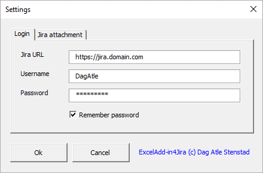
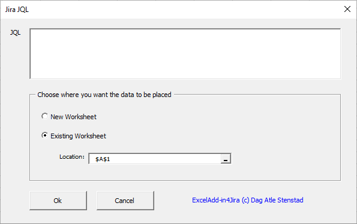
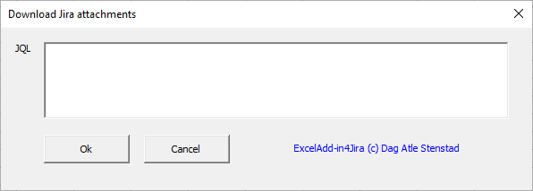

## ExcelAdd-in4Jira, Excel Add-in for Jira

ExcelAdd-in4Jira is an Open Source Excel Add-in that allows you to connect your Jira-data directly to Microsoft Excel. 
ExcelAdd-in4Jira is written in Visual Basic for Application (VBA) in Excel and saved as an Add-in. This means you can use all this functionality from all your Excel sheets. 

# Installation
1. Downaload the latest [version of ExcelAdd-in4Jira](https://github.com/DagAtleStenstad/ExcelAdd-in4Jira/archive/master.zip).
2. Unzip the file. 
3. Add ExcelAdd-in4Jira as a new [Add-in in Excel](https://support.office.com/en-us/article/add-or-remove-add-ins-in-excel-0af570c4-5cf3-4fa9-9b88-403625a0b460).
4. Start Excel og write this formula in a optional cell: **=JiraSettings()**
5. Fill in your Jira URL, username and password. Click <Ok> to save the change. 

#  Use/ formulas
Excel will come up with suggestions as you write a formula. In the suggestion list you can navigate with the arrow keys and press <Tab> to auto-complete and <Tab> again to select.

**=JiraSettings()** open the Add-inn Settings windows. Here you can set:
* Jira URL (URL to your Jira instance)
* Your Jira username
* Your Jira password
* Default downloading folder for Jira attachments

**=createJiraIssue(project, summary, description, issueType, Optional parentKey)** create new Jira issue.
If parentKey is not set the function will create a normal issue. If you want to create a subtask the ParentKey must reference to the issue where you want to create the subtask. 
Example: =createJiraIssue("RISK"; "My first issue"; "Created by ExcelAdd-in4Jira"; "Task")
Example: =createJiraIssue("RISK"; "My first subtask"; "Created by ExcelAdd-in4Jira"; "Sub-task"; "RISK-1")

**=JiraGetIssues()** gets all Jira issues based on a JQL search string. 

**=JiraGetIssueSummary(JiraKey)** get the Jira issue summary.

**=JiraGetIssueCreatedDate(JiraKey)** get the Jira issue created date.

**=JiraGetIssueIssueType(JiraKey)** get the Jira issue issueType.

**=JiraGetIssueAssignee(JiraKey)** get the Jira issue assignee.

**=JiraGetIssueReporter(JiraKey)** get the Jira issue reporter.

**=JiraGetIssueLatestReleaseDate(JiraKey)** get the Jira issue last released date. 

**=JiraGetIssueDaysInTransitions(JiraKey; statuses)** return number of days the issue has been in one or more statuses. 
Example: =JiraGetIssueDaysInTransitions("TE-1"; "Development", "Testing")

**=JiraGetIssueCustomField(JiraKey; CutomFieldName)** get value from the custom field 
Example: =JiraGetIssueCustomField("TE-1"; "Custom field name")

**=JiraDownloadIssuesAttachments(()** download all Jira attachments based on a JQL search string. 

